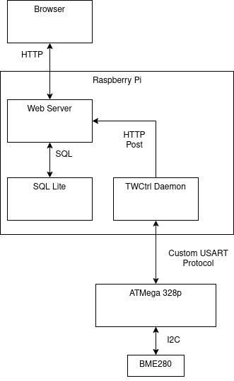

# TinyWeather
__Currently a WIP__

## Introduction
TinyWeather is a small personal weather monitoring system. The system is made of
two components: the controller (this repo) and the [station](https://github.com/dcrussell/tw_station).
The image below provides a high-level overview of the architecture:

# Controller
The purpose of the controller is to remotely control the station, process the weather data,
and store it for later use. At the moment, it's unclear how much of a roll the controller
process will have in providing an interface to view the data. In its current state, the data is
printed to terminal while the process is running.

